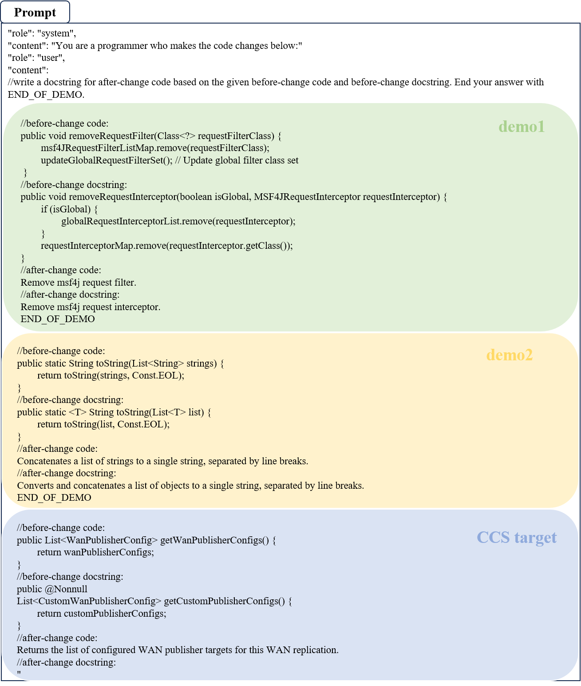
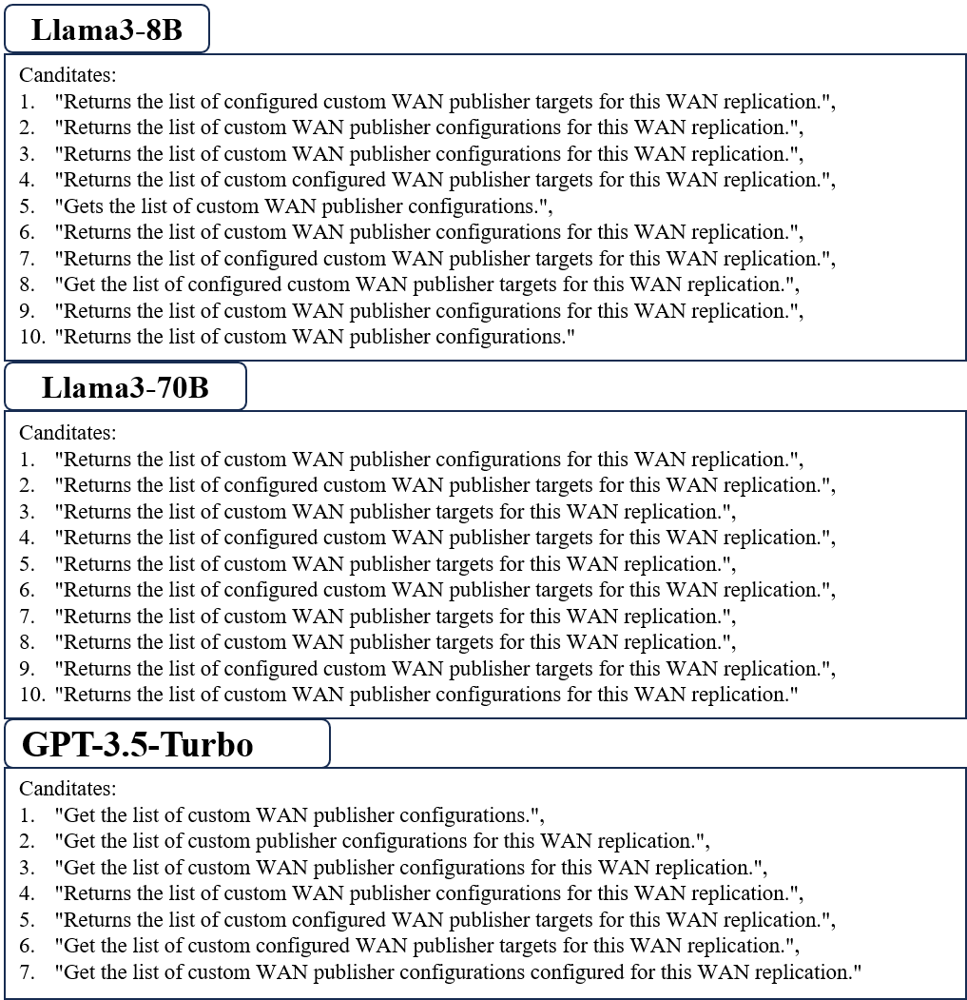

## Readme

### A Prompt Example Illustration

Here we present a prompt used for one CCS target from the **Liu’s** testing set. Using the **EHR** method with a shot number P equals 2.


Demo 1 was retrieved using **CodeBERT Retrieval**, with the following metadata:
`{"sample_id": 3880860, "full_name": "wso2/msf4j", "commit_id": "8df74e2f798af426820f34511492b3c27b96984b"}`

Demo 2 was retrieved using the **Expert Retrieval**, with the following metadata:
`{"sample_id": 3654886, "full_name": "TEAMMATES/teammates", "commit_id": "efa4df2141589cc35ac62fc086481201fa9b6413"}`

The CCS target carries the following metadata:
`{"sample_id": 2231080, "full_name": "hazelcast/hazelcast", "commit_id": "b4af08812320bcadbbd5cd8e496aa8e96993aaa3"}`

The synchronized comment generated by **Llama3-8b **GPT-3.5-Turbo**, and **Llama3-70b** are as follows:




## Quick Start

### Dataset Preparation  
Download the R<sup>2</sup>ComSync dataset from this [link](https://zenodo.org/records/17362180) and unzip it to the dataset folder.
### Retrieval

The demonstration examples retrieved are from the training sets of the respective datasets.
Run the following script to retrieve demonstration examples for CCS targets.

```shell
python retrieval.py  --dataset Hebcup
```
### Generation

Enter sync_comm.sh to modify the required parameters:

```python
SHOT=2  # Number of shots seen by the model
MODEL="llama-70b"  # Select model from ["llama3-70b", "llama3-8b", "gpt3.5"]
API_KEY="your_api_key"  # Replace with actual API key
DATASET="Hebcup"  # Select dataset from ["Hebcup", "Panthap"]
RETRIEVAL="dense"  # Select retrieval way from ["dense", "expert", "random", "hybrid"]
NUM=1  # 1 to 10 for llama3 series, can be removed for gpt models
```

Then use sync_comm.py to call the large language model for generation:

```shell
bash sync_comm.sh
```

Or you can deploy the Llama3 series models and Qwen2.5 series models locally for inference — we provide versions accelerated by vLLM:
```shell
python vllm.py \
  --model_path your-model-path \
  --train_path ./dataset/pai's/train.jsonl \
  --test_path ./dataset/pai's/test.jsonl \
  --retrieval_paths ./retrieval/Pai's/dense_ids.pkl \
                   ./retrieval/Pai's/expert_ids.pkl \
  --output_dir ./result/pai's/qwen1.5b/shot10 \
  --shots 5 \
  --hybrid \
  --max_tokens 100
```

The results of Llama3 or Qwen2.5 need to be post processed:

```shell
python post_process.py \
  --input_dir model's output file \
  --output_dir where you want to save \
  --temp_dir temp.jsonl \
  --shots 2 4 6 8 10 \
  --types dense hybrid expert
```


### Rerank

Use heuristic_rerank.py to rerank and control the effect  changing `unk_threshold` and `exs_threshold`:

```shell
python heuristic_rerank.py --dataset Hebcup --unk_threshold 0.35 --exs_threshold 0.25 --result_path "./result/Liu's/llama3_70b/shot8/llama3_70b_shot8_hybrid.jsonl"
```

You can use the following code to determine the `unk_threshold` and `exs_threshold` required for your dataset.

```shell
python unk_threshold.py
python exs_threshold.py
```

### Evaluation

Use eval.sh for evaluation:

```shell
DATASET="Hebcup" 
TEST_SET="./dataset/"${DATASET}"/test_sampled.jsonl"
OUTPUT_FILE="./result/Hebcup/llama3_70b/shot8/llama3_70b_shot8_hybrid.jsonl_unk0.35_exs0.25.jsonl" #your result

python eval.py ${TEST_SET}  ${OUTPUT_FILE}  ${DATASET}
```


